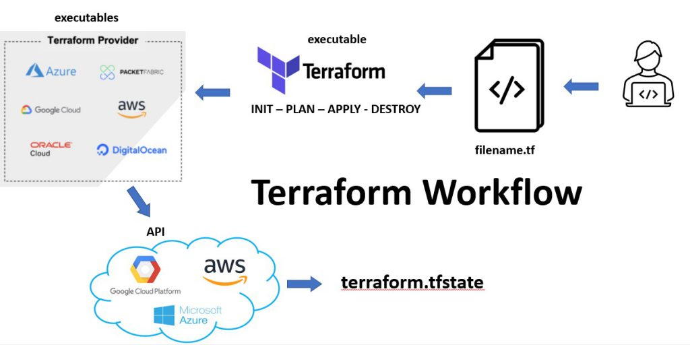

## 1. Wat is Terraform
Terraform is een open-source tool ontwikkeld door HashiCorp die wordt gebruikt voor het beheren van infrastructuur via code, ook wel bekend als Infrastructure as Code (IaC). Met Terraform kun je infrastructuurcomponenten zoals virtuele machines, netwerken en opslagbronnen definiëren, configureren en beheren door middel van een declaratieve configuratietaal. 

### Belangrijkste Kenmerken van Terraform
- Declaratieve Configuratie: Je beschrijft de gewenste staat van je infrastructuur in configuratiebestanden, en Terraform zorgt ervoor dat de daadwerkelijke infrastructuur overeenkomt met deze beschrijving.
- Providers: Terraform ondersteunt een breed scala aan cloudproviders zoals AWS, Azure, Google Cloud, en vele anderen, evenals on-premises oplossingen.
- Plan en Apply: Met terraform plan kun je een overzicht krijgen van de wijzigingen die zullen worden aangebracht, en met terraform apply voer je deze wijzigingen daadwerkelijk door.
- State Management: Terraform houdt de staat van je infrastructuur bij in een state-bestand, zodat het weet welke resources er al zijn en welke moeten worden aangemaakt, bijgewerkt of verwijderd.
- Modulariteit: Je kunt modules gebruiken om herbruikbare stukken infrastructuurcode te maken en te delen, wat het beheer van complexe infrastructuren vereenvoudigt.

## 2. Wat is Infrastructure As Code (IAC)
Infrastructure as Code (IaC) is een methode voor het beheren en inrichten van infrastructuur via leesbare configuratiebestanden, in plaats van handmatige hardwareconfiguraties of interactieve tools (GUIs). Deze aanpak stelt ontwikkelaars en DevOps-Engineers in staat om infrastructuur te beheren met dezelfde technieken en principes die worden toegepast bij softwareontwikkeling.

### Belangrijkste Concepten van IaC

1. Declaratieve en Imperatieve Talen:

    - Declaratief: Je beschrijft de gewenste eindtoestand van de infrastructuur, en de IaC-tool zorgt ervoor dat deze toestand wordt bereikt. Voorbeelden zijn Terraform en Kubernetes YAML.
    - Imperatief: Je schrijft specifieke commando's die in een bepaalde volgorde moeten worden uitgevoerd om de infrastructuur te configureren. Voorbeelden zijn Ansible en Chef.

2. Versiebeheer:

    - IaC-bestanden kunnen worden beheerd met versiebeheersystemen zoals Git, waardoor wijzigingen in de infrastructuur kunnen worden bijgehouden en gecontroleerd.

3. Herhaalbaarheid en Consistentie:

    - Door infrastructuur als code te definiëren, kun je dezelfde configuratie herhaaldelijk toepassen, wat zorgt voor consistentie in verschillende omgevingen (ontwikkel, test, productie).
4. Automatisering:

    - IaC maakt het mogelijk om infrastructuur automatisch te provisioneren en te beheren, wat handmatige configuratiefouten vermindert en de snelheid van implementaties verhoogt.

### Voordelen van IaC
- Snellere Implementatie: Automatisering van infrastructuurprovisioning versnelt de uitrol van nieuwe omgevingen.
- Betere Samenwerking: Teams kunnen samenwerken aan infrastructuurconfiguraties op dezelfde manier als bij softwareontwikkeling.
- Versiebeheer: Wijzigingen in infrastructuur kunnen worden bijgehouden, teruggedraaid en gecontroleerd.
- Consistentie: Vermindert de kans op configuratiefouten door herhaalbare en voorspelbare infrastructuurimplementaties.

## 3. Hoe werkt Terraform

## 4. Workshop

ia onderstaande link kun je starten met de de workshop Azure Terraform basis:

- [start workshop Terraform basic](learn-terraform-azure/workshop-terraform-basic.md)